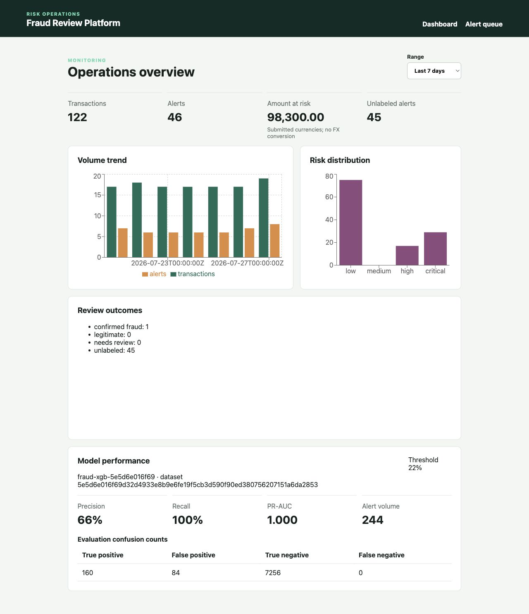
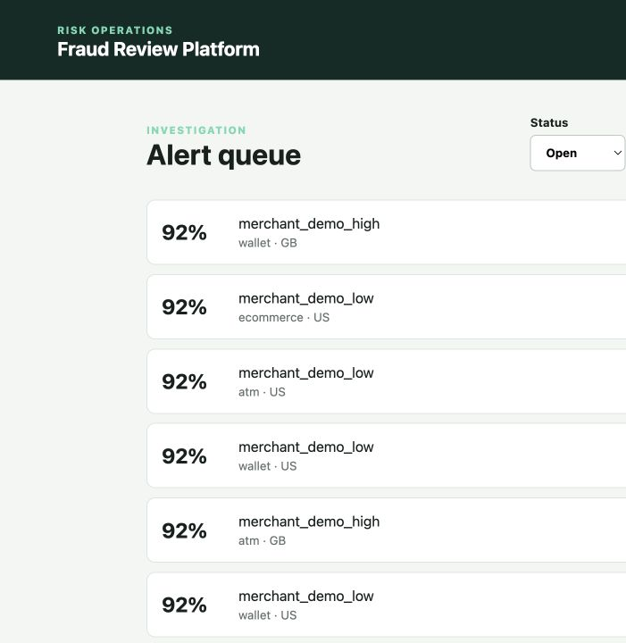
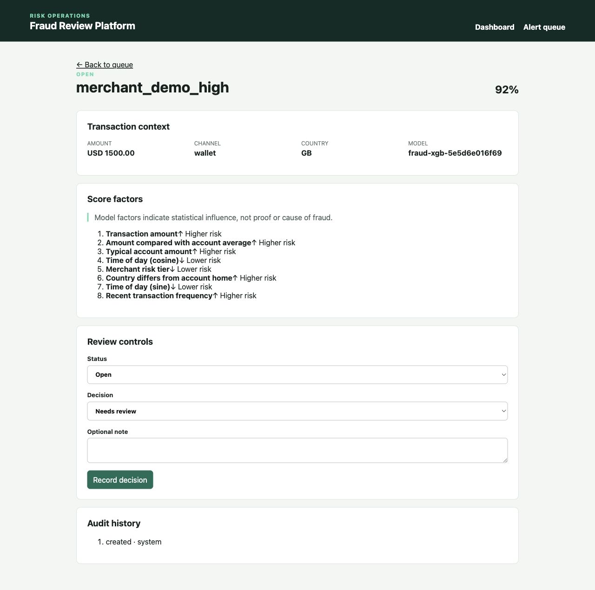

# Fraud Detection Platform

A full-stack fraud detection and analyst review platform inspired by the systems used at payment
processors, brokerages, and banks. It turns synthetic transaction history into point-in-time Spark
features, trains an XGBoost model, scores new transactions through FastAPI, and gives analysts a
dashboard for monitoring and investigation.

The project runs end to end without an external dataset: it generates deterministic financial
activity with planted fraud patterns, builds reproducible analytical datasets, and preserves the
model, feature, threshold, and review history behind every prediction.



---

## How It Works

```text
Synthetic transactions
        ↓
PySpark validation + point-in-time feature engineering
        ↓
Parquet datasets + reproducibility manifests
        ↓
Chronological training + XGBoost model artifact
        ↓
FastAPI scoring → PostgreSQL → React analyst dashboard
```

Spark processes historical activity in batch: validating records, joining account and merchant
context, calculating window features, and writing partitioned Parquet. Training uses chronological
train, validation, and test periods, then exports a versioned model for low-latency API inference.

New transactions are validated and scored once. High-risk scores become alerts ordered by risk,
where an analyst can inspect contributing factors, record a decision, and retain the original
prediction alongside a complete audit trail.

---

## Features

- Deterministic synthetic accounts, merchants, and transactions with planted fraud scenarios
- Distributed Spark validation, joins, historical windows, quality quarantine, and Parquet output
- XGBoost training with chronological evaluation, threshold selection, and model-card generation
- Idempotent transaction ingestion with explicit validation, conflict, and scoring-failure states
- Traceable scores containing model version, feature version, threshold, risk band, and factors
- Risk-prioritized alert queue with filters, explanations, decisions, notes, and audit history
- Dashboard with transaction volume, alerts, amount at risk, risk distribution, review outcomes,
  model identity, precision, recall, PR-AUC, confusion counts, and alert volume
- Reproducible million-row benchmark with environment, timing, size, and lineage evidence

<p>
  
  
</p>

---

## Architecture

```text
                    OFFLINE

Generator → JSONL → PySpark → Parquet → XGBoost
               ↘ quality       ↘ manifests + hashes
                  quarantine

                    ONLINE

Transaction → FastAPI → feature transform → model score
                 ↓                              ↓
             PostgreSQL ← score / alert / review history
                 ↓
          React dashboard
```

PostgreSQL stores operational workflow—transactions, immutable scores, alerts, and analyst
decisions. Parquet stores immutable analytical datasets for Spark and training. Spark stays outside
the request path, so the API can load the exported model directly and score individual transactions
without starting a distributed job.

---

## Engineering Highlights

### Point-in-time correct features

Historical windows use only activity available before each transaction. Spark and the API have
separate batch and scalar implementations, tied together by a versioned feature contract and golden
parity tests. This keeps Spark out of synchronous scoring without allowing offline and online
features to silently drift apart.

### Reproducible data and model lineage

Every generated snapshot, feature dataset, and model is traceable. Manifests record input hashes,
schemas, configuration, feature versions, counts, and output fingerprints. Re-running the same seed
and configuration produces the same dataset identity, while the API verifies the activated model's
SHA-256 before serving it.

### Operationally honest scoring

Transaction IDs are idempotent: identical retries return the original result, while conflicting
payloads are rejected. A transaction, feature snapshot, score, and alert are written atomically. If
the model is unavailable, the transaction enters an explicit `scoring_failed` state—no fallback
probability is presented as a real prediction.

### Evidence-backed scale and evaluation

Model selection uses chronological validation and reports precision, recall, PR-AUC, confusion
counts, and alert volume rather than relying on accuracy. The documented local benchmark processed
1,000,000 synthetic transactions in 64.383 seconds on an 8-logical-CPU ARM Mac, producing about
208 MB of Parquet with zero rejected rows.

---

## Stack

**Data & ML:** Python · PySpark · Spark SQL · Parquet · XGBoost · scikit-learn<br />
**Backend:** FastAPI · PostgreSQL · SQLAlchemy · Alembic<br />
**Frontend:** React · TypeScript · Vite · Recharts<br />
**Tooling:** Docker Compose · pytest · Vitest · Playwright

---

## Run Locally

Requires Docker, Python 3.12, Java 17, Node.js 22, pnpm, `uv`, and `make`.

```bash
cp .env.example .env
make bootstrap
docker compose up -d --wait postgres api frontend
make migrate
make generate-demo SEED=20260727 ROWS=50000
make features
make train
make activate-model
make seed-operational-data
make smoke-score
```

Open [http://localhost:5173](http://localhost:5173).

Run the full verification suite with:

```bash
make check
make test-integration
make test-e2e
```
